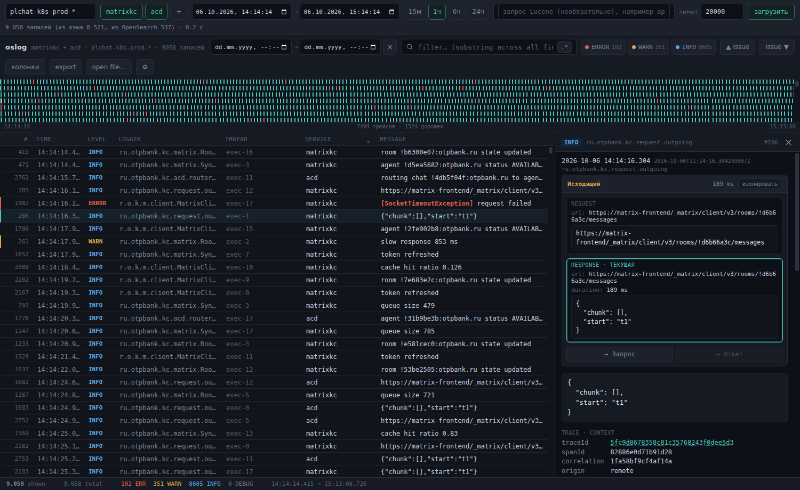
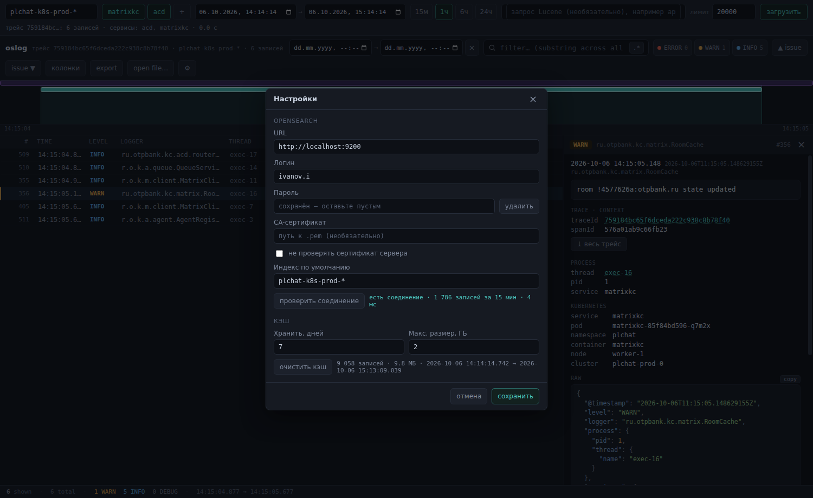
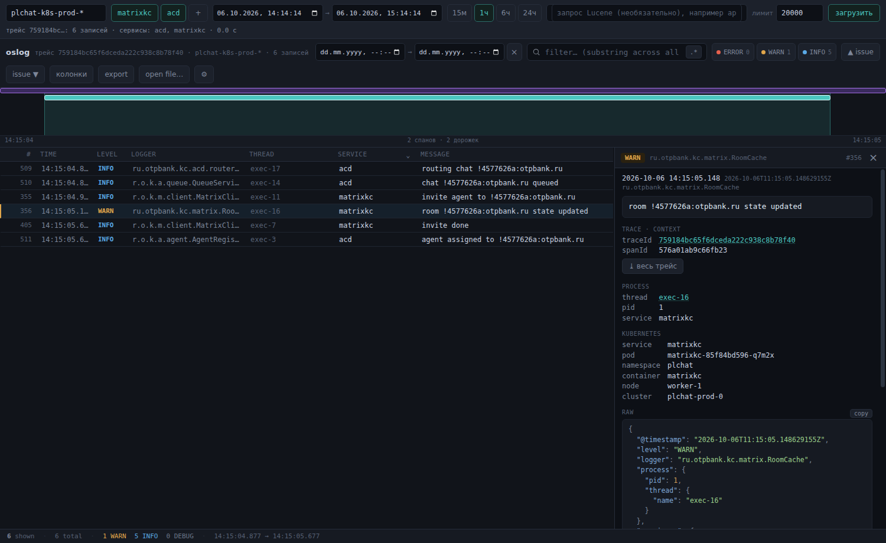

# oslog

**English** · [Русский](README.ru.md)

A desktop viewer for Spring Boot logs (ECS / `FormatterElastic`) straight from OpenSearch — no Dashboards needed. It has the same list, timeline, filters, detail panel and request↔response «Обмен» (exchange) panel as the `logview` viewer, plus an OpenSearch query bar and a local cache: anything loaded once opens instantly and works offline.

The user interface is in Russian; this guide quotes the Russian labels with translations.

## Running

1. Download **[oslog-portable.exe](https://github.com/OlegNyr/oslog/releases/download/latest/oslog-portable.exe)** — the latest build, a single file, no installation. The link is permanent: every new build replaces the file behind it.
2. Run it. The first start takes a few seconds: the file unpacks itself into a temporary folder.
3. Windows may say "Windows protected your PC" (SmartScreen) because the file is not signed. Click **More info → Run anyway**.

## First-time setup

On the first run the settings dialog opens (later: the **⚙** button in the top right corner):

- **URL** — the OpenSearch address, e.g. `https://opensearch.example:9200`;
- **Логин / Пароль** (login / password) — your personal ones;
- **CA-сертификат** (CA certificate) — a path to a `.pem` file, if the cluster certificate is issued by an internal CA that isn't in the Windows certificate store. Usually not needed: corporate root certificates from Windows are picked up automatically. **не проверять сертификат** (don't verify the certificate) — only if nothing else helps;
- **Индекс по умолчанию** (default index) — `plchat-k8s-prod-*`;
- **Кэш** (cache) — how many days to keep (7 by default) and the maximum size (2 GB).

Click **проверить соединение** (test connection) — you should see «есть соединение · N записей за 15 мин» (connected · N records in 15 min). Then **сохранить** (save).

## Usage

The top row is the OpenSearch query:

- **index**;
- **services** (`matrixkc`, `acd`) — click to toggle; several can be on at once: their logs merge into one feed ordered by time and a «service» column appears. **+** adds a service, right-click removes one;
- **time range**, or the quick buttons **15м / 1ч / 6ч / 24ч** (15 min / 1 h / 6 h / 24 h) — they count back from now on every load and load immediately;
- **Lucene query** (optional), e.g. `app.level:ERROR` or `app.traceId:30fcbc00…`;
- **лимит** (limit) — the maximum number of records to load (5,000 by default), newest first;
- **загрузить** (load), or Enter in any field; while loading the button turns into **стоп** (stop) — whatever has loaded by then is shown.

Next to it is the outcome: «7 950 записей (из кэша 7 607, из OpenSearch 343)» (7,950 records: 7,607 from cache, 343 from OpenSearch), «достигнут лимит» (limit reached), or an error (wrong password, no network, a bad Lucene query).

**Density histogram.** Above the timeline: how many records OpenSearch has over the whole query range, not just among the loaded ones — ERROR (red) at the bottom of each bar, WARN (yellow) above it. If the limit was hit, the part of the range that isn't loaded is dimmed and the caption reads «в OpenSearch: N · загружено: M» (in OpenSearch: N · loaded: M). Hover a bar for its time and counts. **Drag across** the histogram to put that range into the query and load it — handy for zooming into a burst. There's no histogram for files, CSV or a whole trace; it is always fetched live from OpenSearch and isn't shown offline.

**Whole trace.** In a record's details, under `traceId`, there is a **⤓ весь трейс** (whole trace) button: it loads every record of that trace from OpenSearch across **all** services (not just the selected ones) within ±1 hour of the record. Clicking the `traceId` value itself still filters what is already loaded. **загрузить** returns to the regular query.

**Sorting.** Click a column header (time, level, logger, thread, message, service and any added column) to sort by it: ▲, click again for ▼, once more for the load order. **Shift+click** adds the column as the next sort key (the headers show ▲1, ▲2…); Shift+clicking it again flips or removes it. For example: level, then service, then time ▼ — errors first, grouped by service, newest on top. Numbers in columns (e.g. `duration`) compare as numbers.

Below is everything the viewer has: search within the loaded records (`/`), time range, levels, **▲ / ▼ issue** (Shift+P / Shift+N), columns, export, trace timeline, record details. Every field in the details has **⊕** (filter by this value) and **▦** (show as a column), including the Kubernetes fields — service, pod, node. Opening a `.log` file or pasting ndjson (Ctrl+V) still works.

**CSV exports from OpenSearch Dashboards** (Discover → Share / Reporting → CSV) open the same way — «open file…», drag and drop or paste. The export must include the `message` column: it holds the original log line, and everything else is read from it. If the export also has `@timestamp`, `pod_labels.app`, `pod`, `namespace`, `container`, `node`, `k8sClusterName`, they are picked up too (service, pod, node in the details and as columns). Records are sorted by time; several files, CSV mixed with `.log` included, merge into one feed.

## Cache and offline use

- Queries **without Lucene** are cached: a repeated or overlapping query takes what is already on disk and fetches only the missing parts from OpenSearch. The last 5 minutes are always fetched again — OpenSearch is still receiving them.
- Queries **with Lucene** and **whole trace** always go to OpenSearch and are not cached.
- Offline, queries without Lucene show what the cache holds for that range, with an error note.
- Old records are removed automatically (by retention and size). **очистить кэш** (clear cache) is in the settings.

## Where things are stored

Everything is in `%APPDATA%\oslog\`, per Windows user; nothing is built into the `.exe`:

- `settings.json` — settings (without the password);
- `password.bin` — the password, encrypted by Windows (DPAPI): it can only be decrypted under your account on this computer;
- `cache.db` — the cache of loaded logs.

The logs contain production data (matrix ids, IPs, URLs). The app talks only to the configured OpenSearch and nowhere else; loaded records are kept only in `cache.db`. On a shared computer, clear the cache.

## Troubleshooting

| Message | What to do |
|---|---|
| `401: неверный логин или пароль` (wrong login or password) | Check the login and password in the settings. |
| `403: нет прав на индекс` (no access to the index) | You need read access to the index — ask the OpenSearch admins. |
| `сертификат не доверен…`, `неизвестный издатель сертификата` (certificate not trusted / unknown issuer) | Set the CA certificate (`.pem`) in the settings. |
| `адрес не найден (DNS)`, `соединение отклонено`, `таймаут` (host not found / connection refused / timeout) | Check the URL and that you are on the network / VPN. |
| `сбой на N из M шардов: … Failed to parse query` (failure on N of M shards) | The Lucene query has an error. |
| `404: index_not_found_exception` | Check the index name. |

## For developers

Requires Node 24. `npm install`, `npm start` — builds the page and starts the app. `npm run dist` — `dist/oslog-portable.exe` (build on Windows or in CI: on every push to `main`, `.github/workflows/build.yml` builds the `.exe` and replaces the single `latest` release with it). A local OpenSearch with test data is in `dev/`. Design and conventions are in `CLAUDE.md` and `docs/PLAN.md`. The screenshots use synthetic data from `dev/load-synthetic.js`.
